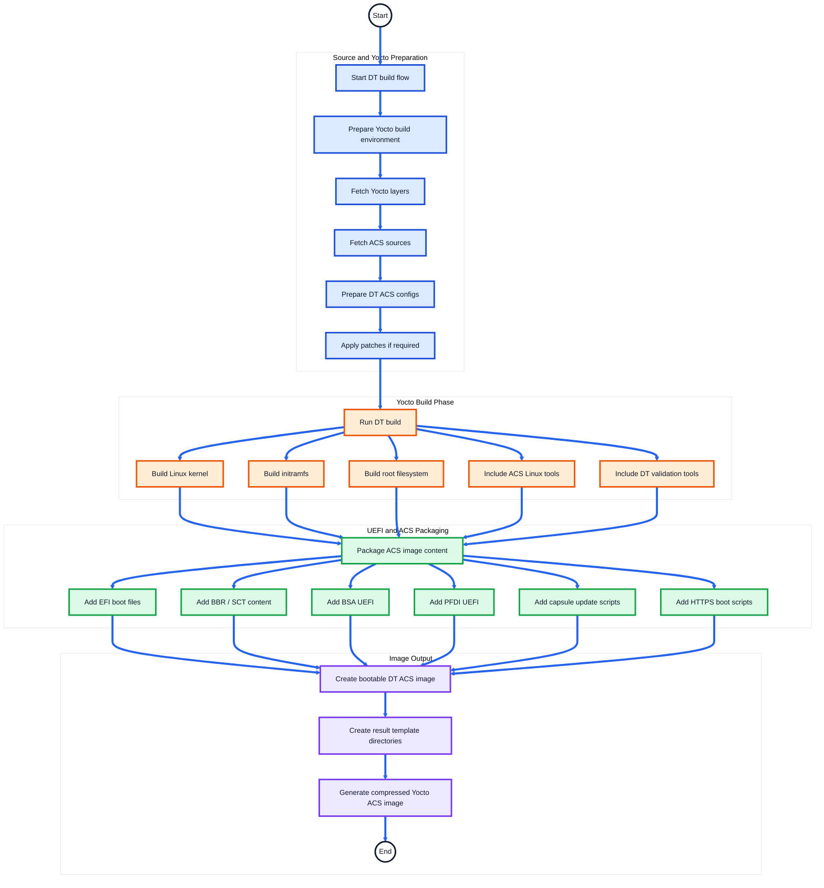

# SystemReady Devicetree Band ACS Automation Flow

## Overview

This document explains the complete automation flow of the **Arm SystemReady Devicetree Band ACS** image.

The SystemReady Devicetree Band ACS image validates platforms that use Devicetree-based firmware and boot flows.

The DT ACS image packages UEFI applications, Linux validation tools, Devicetree validation utilities, firmware tests, network checks, storage checks, capsule update scripts, and ACS log parsing tools into a bootable image.

The automation flow covers:

- Building the Yocto-based ACS image
- Packaging DT-specific UEFI and Linux tools
- Booting through GRUB
- Running UEFI-side BBR, BSA, PFDI, and firmware tests
- Booting into Linux
- Running FWTS, BSA, Devicetree, network, block device, and driver checks
- Collecting logs
- Generating the final ACS summary report

---

## What the DT Image Validates

| Validation Area | Tools / Test Suites |
|---|---|
| Firmware compliance | BBR, SCT, SCRT |
| Base system architecture | BSA |
| Secure Boot compliance | BBSR |
| Firmware behavior | FWTS |
| Devicetree correctness | Devicetree validation tools |
| Kernel behavior | Kernel selftests |
| Platform fault interface | PFDI |
| Network functionality | UEFI ping test, ethtool test |
| Block device behavior | Block device read/write checks |
| Capsule update | Capsule update scripts and UEFI apps |
| HTTPS boot | HTTPS boot validation scripts |
| Result reporting | ACS log parser and waiver flow |

---
## SystemReady Devicetree Band ACS Automation Flow

This section explains the end-to-end automation flow for the SystemReady Devicetree Band ACS image.

The flow is divided into two parts:

1. **Build Automation Flow** — how the DT ACS image is prepared and generated.
2. **Run Automation Flow** — what happens when the DT ACS image boots on the platform.
---

### DT Build Automation Flow

The DT build automation prepares the Yocto-based image, packages UEFI applications, Linux-side validation tools, Devicetree utilities, and result directories.



---

### DT Runtime Automation Flow

The default runtime automation starts from the GRUB option:

```text
bbr/bsa
```

The flow starts in UEFI, runs firmware, BBR, BSA, PFDI, capsule, HTTPS boot, and debug checks where configured, then boots into Yocto Linux for Linux-side and Devicetree validation.

```mermaid
%%{init: {
  "theme": "base",
  "themeVariables": {
    "fontFamily": "Arial",
    "fontSize": "14px",
    "primaryBorderColor": "#0f172a",
    "lineColor": "#2563eb",
    "tertiaryColor": "#ffffff"
  }
}}%%

flowchart TD

    linkStyle default stroke:#2563eb,stroke-width:4px;

    Start((Start)) --> G0

    subgraph GRUB["Boot Entry"]
        direction TB
        G0["Power on / reset platform"] --> G1["GRUB menu"]
        G1 --> G2{"Selected boot option?"}
    end

    G2 -->|"bbr/bsa"| U0
    G2 -->|"Linux Boot"| LB0
    G2 -->|"BBSR Compliance<br/>Automation"| BBSR0

    subgraph UEFI_PHASE["UEFI Automation Phase"]
        direction TB
        U0["Run EFI/BOOT/startup.nsh<br/>or startup_dt.nsh"] --> U1["Load DT ACS configuration"]
        U1 --> SB0{"Secure Boot<br/>clearance required?"}
    end

    SB0 -->|"yes"| SB1
    SB0 -->|"no"| H0

    subgraph SECURE_BOOT_REBOOT["Secure Boot Clearance Reboot"]
        direction TB
        SB1["Clear Secure Boot PK / variables"] --> SB2["Create boot-to-Linux flag"]
        SB2 --> SB3["Reset / reboot required"]
        SB3 --> G1
    end

    subgraph UEFI_OPTIONAL_CHECKS["UEFI Optional Checks"]
        direction TB
        H0{"HTTPS / network boot<br/>configured?"}
        H0 -->|"yes"| H1["Run HTTPS / network boot check"]
        H0 -->|"no"| U2["Continue UEFI tests"]
        H1 --> H2{"Network boot flow<br/>requires reboot?"}
        H2 -->|"yes"| H3["Reset / reboot after<br/>network boot validation"]
        H2 -->|"no"| U2
        H3 --> G1
    end

    subgraph UEFI_TESTS["UEFI Compliance Tests"]
        direction TB
        U2 --> U3["Run SCT / BBR"]
        U3 --> U4["Run SCRT if applicable"]
        U4 --> U5["Run BSA UEFI"]
        U5 --> U6["Run PFDI UEFI"]
        U6 --> C0{"Capsule update<br/>configured?"}
    end

    C0 -->|"yes"| C1
    C0 -->|"no"| U7

    subgraph CAPSULE_FLOW["Capsule Update Flow"]
        direction TB
        C1["Run capsule update scripts"] --> C2["Stage capsule update"]
        C2 --> C3{"Capsule requires<br/>system reboot?"}
        C3 -->|"yes"| C4["Reset / reboot to apply capsule"]
        C3 -->|"no"| U7
        C4 --> G1
    end

    subgraph UEFI_TO_LINUX["UEFI to Linux Transition"]
        direction TB
        U7["Run UEFI debug and ping checks"] --> U8["Collect UEFI logs"]
        U8 --> REBOOT0["Reset / reboot into Linux path"]
        REBOOT0 --> BOOT0["Boot Yocto Linux kernel"]
        BOOT0 --> BOOT1["Load initramfs"]
        BOOT1 --> BOOT2["Start Linux automation"]
    end

    LB0["Direct Linux Boot path"] --> BOOT0

    subgraph LINUX_PHASE["Linux and Devicetree Validation Phase"]
        direction TB
        BOOT2 --> L0["Run init.sh"]
        L0 --> L1["Mount ACS result directories"]
        L1 --> L2["Run FWTS"]
        L2 --> L3["Run BSA Linux"]
        L3 --> L4["Run Devicetree validation"]
        L4 --> L5["Run kernel selftests"]
        L5 --> L6["Run device driver checks"]
        L6 --> L7{"Network checks enabled?"}
        L7 -->|"yes"| L8["Run network checks"]
        L7 -->|"no"| L9["Skip network checks"]
        L8 --> L10{"Block device checks enabled?"}
        L9 --> L10
        L10 -->|"yes"| L11["Run block device checks"]
        L10 -->|"no"| L12["Skip block device checks"]
        L11 --> R0
        L12 --> R0
    end

    subgraph RESULT_PHASE["Result Processing Phase"]
        direction TB
        R0["Collect UEFI and Linux logs"] --> R1["Parse SCT results"]
        R1 --> R2["Run ACS log parser"]
        R2 --> R3{"Waivers configured?"}
        R3 -->|"yes"| R4["Apply waivers"]
        R3 -->|"no"| R5["Skip waiver processing"]
        R4 --> R6["Generate ACS summary"]
        R5 --> R6
        R6 --> R7["acs_results_template/acs_results/acs_summary"]
        R7 --> End((End))
    end

    subgraph BBSR_PHASE["BBSR Automation Path"]
        direction TB
        BBSR0["Run bbsr_startup.nsh"] --> B0{"Secure Boot enabled?"}
        B0 -->|"yes"| B3["Run BBSR UEFI tests"]
        B0 -->|"no"| B1["Provision Secure Boot keys"]
        B1 --> B2["Reset / reboot required"]
        B2 --> G1
        B3 --> B4["Boot Secure Linux path"]
        B4 --> B5["Run secure_init.sh"]
        B5 --> B6["Collect BBSR logs"]
        B6 --> R1
    end

    classDef startEnd fill:#ffffff,stroke:#0f172a,stroke-width:3px,color:#0f172a;
    classDef grub fill:#dbeafe,stroke:#1d4ed8,stroke-width:3px,color:#0f172a;
    classDef decision fill:#ffffff,stroke:#2563eb,stroke-width:3px,color:#0f172a;
    classDef uefi fill:#ffedd5,stroke:#ea580c,stroke-width:3px,color:#0f172a;
    classDef reboot fill:#fee2e2,stroke:#dc2626,stroke-width:3px,color:#0f172a;
    classDef linux fill:#dcfce7,stroke:#16a34a,stroke-width:3px,color:#0f172a;
    classDef result fill:#ede9fe,stroke:#7c3aed,stroke-width:3px,color:#0f172a;

    class Start,End startEnd;
    class G0,G1,G2 grub;
    class U0,U1,U2,U3,U4,U5,U6,U7,U8,H1,C1,C2,BBSR0,B1,B3,B4,B5,B6 uefi;
    class SB1,SB2,SB3,H3,C4,REBOOT0,B2 reboot;
    class BOOT0,BOOT1,BOOT2,LB0,L0,L1,L2,L3,L4,L5,L6,L8,L9,L11,L12 linux;
    class R0,R1,R2,R4,R5,R6,R7 result;
    class SB0,H0,H2,C0,C3,L7,L10,R3,B0 decision;
```



---

### DT Runtime Summary

```text
GRUB
  └── bbr/bsa
        └── UEFI startup.nsh / startup_dt.nsh
              ├── Secure Boot clearance, if required
              │     └── reboot back to GRUB
              ├── HTTPS / network boot check, if configured
              │     └── reboot back to GRUB, if required
              ├── SCT / BBR / SCRT
              ├── BSA UEFI
              ├── PFDI UEFI
              ├── Capsule update, if configured
              │     └── reboot back to GRUB, if capsule requires reset
              ├── UEFI debug / ping checks
              └── reboot / transition to Linux
                    └── Yocto Linux init.sh
                          ├── FWTS
                          ├── BSA Linux
                          ├── Devicetree validation
                          ├── Kernel selftests
                          ├── Device driver checks
                          ├── Network checks, if enabled
                          ├── Block device checks, if enabled
                          └── ACS summary generation
```
---

## 9. GRUB Boot Menu Options

| Boot Option | Purpose |
|---|---|
| `Linux Boot` | Boots Yocto Linux environment |
| `bbr/bsa` | Runs the main DT automation flow |
| `BBSR Compliance (Automation)` | Runs Secure Boot / BBSR compliance flow |

---

## Configuration Files

| File | Description |
|---|---|
| `acs_config.txt` | Contains ACS and specification version information |
| `system_config.txt` | Contains platform information used in the final ACS report |

Important DT-related configuration fields:

| Field | Description |
|---|---|
| `Total_number_of_network_controllers` | Number of network controllers expected for validation |
| `HTTPS_BOOT_IMAGE_URL` | URL used for HTTPS boot validation |

---

## Result Collection

DT ACS results are collected under:

```text
acs_results_template/
```

| Directory | Purpose |
|---|---|
| `acs_results_template/acs_results/` | Main ACS logs and test results |
| `acs_results_template/fw/` | Firmware and capsule update logs |
| `acs_results_template/os-logs/` | Manual OS test logs |

Final parsed reports are generated under:

```text
acs_results_template/acs_results/acs_summary/
```
