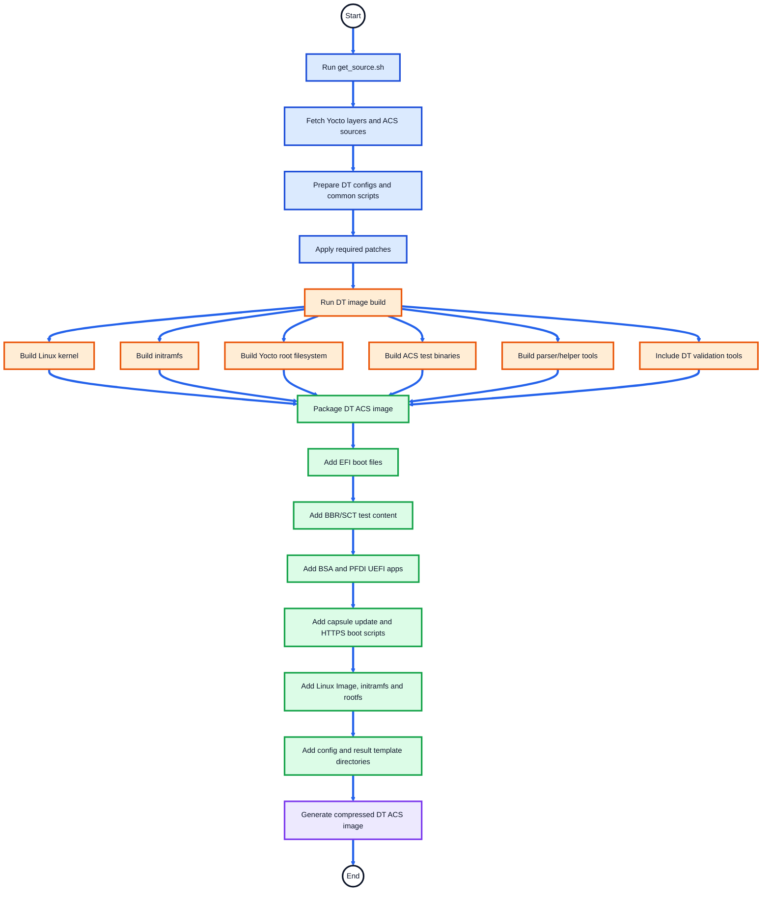

# SystemReady Devicetree Band ACS Automation Flow

## Overview

This document explains the automation flow of the **Arm SystemReady Devicetree Band ACS** image.

The SystemReady Devicetree Band ACS image is a bootable validation environment used to run firmware, UEFI, Linux, Devicetree, architecture, network, capsule update, and compliance test suites on Arm SystemReady Devicetree platforms.

The automation flow covers:

- Image validations
- SystemReady Devicetree Band ACS Automation Flow
- GRUB Boot Menu Options
- Configuration Files
- Result Collection

---

## What the DT Image Validates

| Validation Area | Tools / Test Suites |
|---|---|
| UEFI firmware compliance | SCT, SCRT, BBR |
| Base system architecture | BSA |
| Platform firmware/device interface | PFDI |
| Firmware behavior | FWTS |
| Secure Boot compliance | BBSR |
| Devicetree validation | DT validation tools, DT parser, DT kernel selftests |
| Linux device visibility | Device driver information script |
| Network validation | UEFI ping test, HTTPS/network boot, Ethernet/network checks |
| Block device validation | Block device read/write checks |
| Capsule update | Capsule update scripts and UEFI apps |
| Result reporting | EDK2 test parser, ACS log parser, waiver flow |

---

## SystemReady Devicetree Band ACS Automation Flow

This section explains the end-to-end automation flow for the SystemReady Devicetree Band ACS image.

The flow is divided into two parts:

1. **Build Automation Flow** — how the DT ACS image is prepared and generated.
2. **Run Automation Flow** — what happens when the DT ACS image boots on the platform.

---

### DT Build Automation Flow

Commands executed from **arm-systemready/SystemReady-devicetree-band/Yocto/**:

```text
./build-scripts/get_source.sh
./build-scripts/build-systemready-dt-band-live-image.sh
```



---
### DT Runtime Automation Flow

> **Reboot handling:** Some DT flows intentionally reset the platform after saving state or results.  
> After reset, the platform returns to **GRUB** and resumes from the next pending stage using result logs, state files, or flags.

#### Legend

| Marker | Interpretation |
|---|---|
| 🟦 | GRUB / boot entry |
| 🟧 | UEFI phase |
| 🟩 | Linux phase |
| 🟥 | Reset / reboot |
| 🟪 | Result processing |
| 🟨 | BBSR flow |
| 🟫 | Optional flow |

```text
🟦 𝗚𝗥𝗨𝗕
│
├── 🟩 𝗟𝗶𝗻𝘂𝘅 𝗕𝗼𝗼𝘁
│   ├── Executed when Yocto Linux is booted directly from GRUB or UEFI automation completes
│   └── 🟩 𝗟𝗶𝗻𝘂𝘅 𝗶𝗻𝗶𝘁.𝘀𝗵
│       ├── Mount ACS result directories
│       ├── Check boot-to-Linux / network boot / secureboot / scmi_acs state
│       ├── Linux debug dump
│       ├── FWTS
│       ├── BSA Linux
│       ├── Device driver information
│       ├── Devicetree validation
│       ├── PSCI collection
│       ├── DT kernel selftest
│       ├── Ethernet diagnostic test
│       ├── Block device check
│       ├── Runtime device mapping conflict check
│       ├── 🟫 𝗡𝗲𝘁𝘄𝗼𝗿𝗸 𝗯𝗼𝗼𝘁 𝗳𝗹𝗼𝘄, if HTTPS_BOOT_IMAGE_URL is configured
│       │   ├── Run Linux pre-boot checks
│       │   └── 🟥 𝗥𝗘𝗕𝗢𝗢𝗧
│       │       └── 🟧 𝗨𝗘𝗙𝗜 𝗵𝘁𝘁𝗽𝘀_𝗯𝗼𝗼𝘁.𝗻𝘀𝗵
│       │           └── Boot ACS minimal network image and reset after logs collection 
│       │           └── 🟥 𝗥𝗘𝗕𝗢𝗢𝗧 
│       │               └── 🟩 Boot back to main ACS Linux, Run network boot result parser
│       │
│       ├── Capsule update result check
│       └── 🟪 𝗥𝗲𝘀𝘂𝗹𝘁 𝗽𝗿𝗼𝗰𝗲𝘀𝘀𝗶𝗻𝗴
│           ├── EDK2 test parser
│           ├── SystemReady post scripts
│           ├── ACS log parser
│           ├── Apply waivers, if configured
│           └── Generate acs_results_template/acs_results/acs_summary
│
├── 🟧 𝗯𝗯𝗿/𝗯𝘀𝗮 𝗔𝗖𝗦 (𝗔𝘂𝘁𝗼𝗺𝗮𝘁𝗶𝗼𝗻)
│   └── 🟧 𝗨𝗘𝗙𝗜 𝘀𝘁𝗮𝗿𝘁𝘂𝗽.𝗻𝘀𝗵 / 𝘀𝘁𝗮𝗿𝘁𝘂𝗽_𝗱𝘁.𝗻𝘀𝗵
│       ├── If HTTPS boot is pending, continue with the network boot flow
│       ├── If BBSR is in progress, resume BBSR flow
│       ├── SCT / BBR / SCRT
│       ├── Capsule information dump
│       ├── UEFI debug dump
│       ├── 🟧 𝗕𝗦𝗔 𝗨𝗘𝗙𝗜
│       │   ├── Run Bsa.efi
│       │   ├── Save BSA result log
│       │   └── 🟥 𝗥𝗘𝗦𝗘𝗧
│       │       └── Resume from GRUB and continue automation
│       ├── 🟧 𝗣𝗙𝗗𝗜 𝗨𝗘𝗙𝗜
│       │   ├── Run PFDI test
│       │   ├── Save PFDI result log
│       │   └── 🟥 𝗥𝗘𝗦𝗘𝗧
│       │       └── Resume from GRUB and continue automation
│       ├── UEFI ping test
│       ├── Capsule update flow
│       │   ├── Run and stage capsule update
│       │   └── 🟥 𝗥𝗘𝗦𝗘𝗧, if capsule update requires reset
│       │       └── Resume from GRUB and continue automation
│       └── 🟩 𝗕𝗼𝗼𝘁 𝗟𝗶𝗻𝘂𝘅
│           └── Continue with Linux Boot flow above
│
└── 🟨 𝗕𝗕𝗦𝗥 𝗖𝗼𝗺𝗽𝗹𝗶𝗮𝗻𝗰𝗲 (𝗔𝘂𝘁𝗼𝗺𝗮𝘁𝗶𝗼𝗻)
    └── bbsr_startup.nsh
        ├── Check Secure Boot state
        ├── Provision Secure Boot keys
        │   └── If not done automatically, provision keys manually
        │       └── 🟥 𝗥𝗘𝗦𝗘𝗧
        │           └── Resume BBSR flow from GRUB
        ├── Run BBSR UEFI / SCT flow
        ├── Secure Linux boot
        └── 🟩 Linux secure_init.sh
            ├── Run Linux-side BBSR checks
            ├── Collect BBSR logs
            ├── If Secure Boot is still enabled
            │   ├── Create clear_secureboot flag
            │   └── 🟥 𝗥𝗘𝗕𝗢𝗢𝗧
            │       └── 🟧 𝗨𝗘𝗙𝗜 𝗦𝗲𝗰𝘂𝗿𝗲 𝗕𝗼𝗼𝘁 𝗰𝗹𝗲𝗮𝗿𝗮𝗻𝗰𝗲
            │           └── 🟥 𝗥𝗘𝗕𝗢𝗢𝗧
            │               └── Boot Linux terminal
            └── 🟪 Generate BBSR / ACS summary
```
---

## GRUB Boot Menu Options

| Boot Option | Purpose |
|---|---|
| `Linux Boot` | Boots Yocto Linux environment |
| `bbr/bsa` | Runs the main automated DT compliance flow |
| `BBSR Compliance (Automation)` | Runs Secure Boot / BBSR compliance flow |

---

## Configuration Files

| File | Description |
|---|---|
| `acs_config.txt` | Contains ACS and specification version information |
| `system_config.txt` | Contains platform details used in the final ACS report |
| `acs_config_dt.txt` | DT-specific ACS configuration template/source |
| `system_config_dt.txt` | DT-specific system configuration template/source |

Important DT-related configuration fields:

| Field | Description |
|---|---|
| `Total_number_of_network_controllers` | Number of network controllers expected for validation |
| `HTTPS_BOOT_IMAGE_URL` | URL used for HTTPS/network boot validation |

---

## Result Collection

DT ACS logs and summaries are stored under:
```text
acs_results_template/acs_results/
```

Firmware and capsule-related logs may be stored under:
```text
acs_results_template/fw/
```

Manual OS compliance logs may be stored under:
```text
acs_results_template/os-logs/
```

Final parsed reports are generated under:
```text
acs_results_template/acs_results/acs_summary/
```
