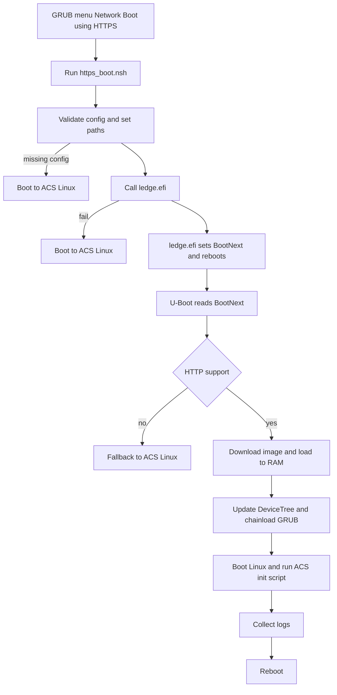

# Network Boot Support in SystemReady-DT

This is an overview of **HTTPS Boot** support implemented within the **SystemReady-DT ACS image**

---

## Overview

This repository extends the **Arm SystemReady Devicetree** Yocto build with
support for **HTTPS/HTTP Network Boot** using a custom UEFI application
(`ledge.efi`).  
The integration includes:

- GRUB menu entry `Network Boot using HTTP(s)`
- A HTTPS Boot script (`https_boot.nsh`)
- Config file for image path (`acs_https.conf.nsh`)
- Yocto recipe to build and bundle `ledge.efi`
- Fallback logic to local Linux boot if network boot fails

---
## Requirements
 - U-Boot must support HTTP(S) boot and pmem
 - U-Boot must have working network drivers
 - System must have a valid ESP
   -  Required for BootNext to persist over reboot.
 - Linux kernel must have the pmem driver enabled
 - Minimal Image must provide:
     - logging tools (lsblk, blkid, dmesg)
     - writing logs back to the ACS result partition
---
## Directory Structure
```
Script files path - FSx:\
 ├── acs_tests\
 │    ├── app\
 │    │    ├── ledge.efi
 │    │    └── network_boot_in_progress.flag
 │    ├── config\
 │    │    └── acs_https.conf.nsh
 │    └── acs_results_template\
 │         └── acs_results\
 │              └── network_boot\
 │                   ├── https_boot_console.log        
 │                   ├── lsblk.txt                     
 │                   ├── blkid.txt                     
 │                   ├── dmesg.txt                     
 └── EFI\
      └── BOOT\
           └── https_boot.nsh
```
---
## HTTPS Boot Flow

1. **User selects “Network Boot using HTTP(s)” in GRUB**  
   GRUB passes control to `Shell.efi` with `https_boot.nsh` as the startup script for this session.

2. **UEFI Script: https_boot.nsh**  
   - Loads configuration from `acs_https.conf.nsh` 
   - Validates necessary variables (URL, scheme, hostpath)  
   - Calls `ledge.efi.`

3. `ledge.efi` performs:
   - Set `Boot####` to point to the remote URL
   - Set `BootNext = Boot####`
   - Reboot the platform

4. U-Boot performs further operation:
   - U-Boot processes the `BootNext` entry
   - Downloads image via HTTP(s)
   - Loads the downloaded ACS Minimal Image into RAM
   - Modifies DeviceTree to include a `pmem` node
   - Chainloads **GRUB** from the downloaded image
   - GRUB boots the network-downloaded **Linux kernel** with updated DeviceTree.
   - Linux mounts the downloaded image, runs its ACS tests/services, collects logs, and reboots back into the ACS environment.
  
5. Network boot flags
   - `network_boot_success` and `network_boot_in_progress` are used to track the progress of the Network Boot on reboot.

The following flowchart shows the HTTPS boot sequence used in the ACS DT image.

---
## Constraints
 - The current setup requires three config parameters; a more flexible parser is under development and will be supported soon.
 - ESP detection from UEFI shell is ongoing, so that network boot will be skipped when no valid ESP is present.
 - Failures in U-Boot are not logged and must be debugged from the U-Boot console. Such as,
   - `Cannot persist EFI variables without system partition`
   - `Loading from BootNext failed, falling back to BootOrder`
---
