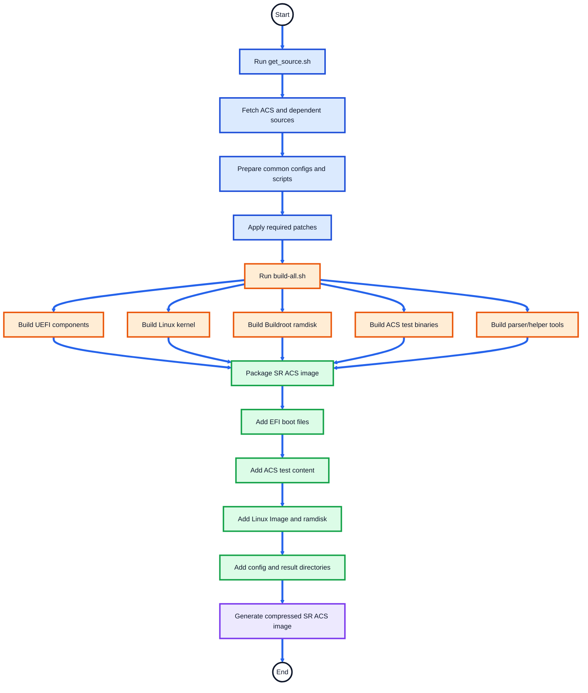

# SystemReady Band ACS Automation Flow

## Overview

This document explains the automation flow of the **Arm SystemReady Band ACS** image.

The SystemReady Band ACS image is a bootable validation environment used to run firmware, UEFI, Linux, architecture, and compliance test suites on Arm SystemReady platforms.

The automation flow covers:

- Image validations
- SystemReady Band ACS Automation Flow
- GRUB Boot Menu Options
- Configuration Files
- Result Collection

---

## What the SR Image Validates

| Validation Area | Tools / Test Suites |
|---|---|
| UEFI firmware compliance | SCT, SCRT, BBR |
| Base system architecture | BSA |
| Server architecture | SBSA |
| Firmware behavior | FWTS |
| Secure Boot compliance | BBSR |
| Manageability checks | SBMR |
| Linux-side validation | Linux scripts and test tools |
| Result reporting | ACS log parser and waiver flow |

---

## SystemReady Band ACS Automation Flow

This section explains the end-to-end automation flow for the SystemReady Band ACS image.

The flow is divided into two parts:

1. **Build Automation Flow** — how the ACS image is prepared and generated.
2. **Run Automation Flow** — what happens when the ACS image boots on the platform.

---
### SR Build Automation Flow

Commands executed from **arm-systemready/SystemReady-band/**:

```text
./build-scripts/get_source.sh
./build-scripts/build-systemready-band-live-image.sh
```


---
### SR Runtime Automation Flow

> **Reboot handling:** Some test suites intentionally reset the platform after saving results. After reset, the platform returns to **GRUB** and resumes from the next pending stage. Completed suites are skipped using result logs or state.

#### Legend

| Marker | Interpretation |
|---|---|
| 🟦 | GRUB / boot entry |
| 🟧 | UEFI phase |
| 🟩 | Linux phase |
| 🟥 | Reset / reboot |
| 🟪 | Result processing |
| 🟨 | BBSR flow |
| ⬜ | Manual execution |

```text
🟦 𝗚𝗥𝗨𝗕
│
├── 🟩 𝗟𝗶𝗻𝘂𝘅 𝗕𝗼𝗼𝘁
│   ├── Executed when ACS Linux is booted directly from GRUB or UEFI automation completes
│       └── 🟩 𝗟𝗶𝗻𝘂𝘅 𝗶𝗻𝗶𝘁.𝘀𝗵
│           ├── Parse ACS run configuration
│           ├── Linux debug dump
│           ├── Device driver information
│           ├── FWTS
│           ├── SBMR in-band, if enabled in config
│           ├── BSA Linux
│           ├── SBSA Linux, if enabled in config
│           └── 🟪 𝗥𝗲𝘀𝘂𝗹𝘁 𝗽𝗿𝗼𝗰𝗲𝘀𝘀𝗶𝗻𝗴
│               ├── EDK2 test parser
│               ├── SystemReady post scripts
│               ├── ACS log parser
│               ├── Apply waivers, if configured
│               └── Generate acs_results/acs_summary
│
├── 🟧 𝗦𝘆𝘀𝘁𝗲𝗺𝗥𝗲𝗮𝗱𝘆 𝗯𝗮𝗻𝗱 𝗔𝗖𝗦 (𝗔𝘂𝘁𝗼𝗺𝗮𝘁𝗶𝗼𝗻)
│   └── 🟧 𝗨𝗘𝗙𝗜 𝘀𝘁𝗮𝗿𝘁𝘂𝗽.𝗻𝘀𝗵
│       ├── Parser.efi / ACS configuration
│       │   └── User input to enable or disable selected test suites
│       ├── SCT / BBR / SCRT
│       ├── Capsule information dump
│       ├── UEFI debug dump
│       │
│       ├── 🟧 𝗕𝗦𝗔 𝗨𝗘𝗙𝗜
│       │   ├── Run Bsa.efi
│       │   ├── Save BSA result log
│       │   └── 🟥 𝗥𝗘𝗦𝗘𝗧
│       │       └── Resume from GRUB and continue automation
│       │
│       ├── 🟧 𝗦𝗕𝗦𝗔 𝗨𝗘𝗙𝗜, If enabled in config
│       │   ├── Run Sbsa.efi
│       │   ├── Save SBSA result log
│       │   └── 🟥 𝗥𝗘𝗦𝗘𝗧
│       │       └── Resume from GRUB and continue to Linux phase
│       │
│       └── 🟩 𝗕𝗼𝗼𝘁 𝗟𝗶𝗻𝘂𝘅
│           └── Continue with Linux Boot (see Linux Boot flow above)
│
├── 🟨 𝗕𝗕𝗦𝗥 𝗖𝗼𝗺𝗽𝗹𝗶𝗮𝗻𝗰𝗲 (𝗔𝘂𝘁𝗼𝗺𝗮𝘁𝗶𝗼𝗻)
│   └── bbsr_startup.nsh
│       ├── Check Secure Boot state
│       ├── Provision Secure Boot keys
│       │   └── If not done automatically, provision keys manually
│       │       └── 🟥 𝗥𝗘𝗦𝗘𝗧
│       │           └── Resume BBSR flow from GRUB
│       ├── Run BBSR UEFI / SCT flow
│       ├── Secure Linux boot
│       └── 🟩 Linux secure_init.sh
│           ├── Run Linux-side BBSR checks
│           ├── Collect BBSR logs
│           └── 🟪 Generate BBSR / ACS summary
│
├── ⬜ 𝗨𝗘𝗙𝗜 𝗘𝘅𝗲𝗰𝘂𝘁𝗶𝗼𝗻 𝗘𝗻𝘃𝗶𝗿𝗼𝗻𝗺𝗲𝗻𝘁
│   └── Enter UEFI shell
│       └── User runs selected UEFI-side tests manually
│
└── ⬜ 𝗟𝗶𝗻𝘂𝘅 𝗘𝘅𝗲𝗰𝘂𝘁𝗶𝗼𝗻 𝗘𝗻𝘃𝗶𝗿𝗼𝗻𝗺𝗲𝗻𝘁
    └── Boot ACS Linux shell
        └── User runs selected Linux-side tests manually
```
---
## GRUB Boot Menu Options

| Boot Option | Purpose |
|---|---|
| `Linux Boot` | Boots ACS Linux environment |
| `SystemReady band ACS (Automation)` | Runs the complete automated SR compliance flow |
| `BBSR Compliance (Automation)` | Runs Secure Boot / BBSR compliance flow |
| `UEFI Execution Environment` | Provides manual UEFI shell execution environment |
| `Linux Execution Environment` | Provides manual Linux-side execution environment |
| `Linux Boot with SetVirtualAddressMap enabled` | Debug or special Linux boot option |
---

## Configuration Files

| File | Description |
|---|---|
| `acs_config.txt` | Contains ACS and specification version information |
| `acs_run_config.ini` | Enables or disables test suites and passes test arguments |
| `system_config.txt` | Contains platform details used in the final ACS report |

---
## Result Collection

ACS logs and summaries are stored under:
```text
acs_results/
```

Final parsed reports are generated under:
```text
acs_results/acs_summary/
```
