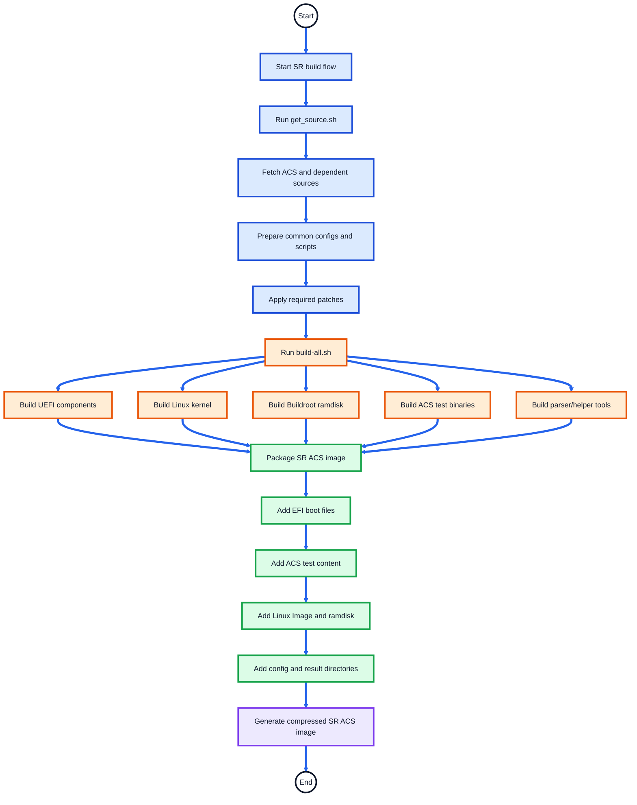

# SystemReady Band ACS Automation Flow

## Overview

This document explains the complete automation flow of the **Arm SystemReady Band ACS** image.

The SystemReady Band ACS image is a bootable validation environment used to run firmware, UEFI, Linux, architecture, and compliance test suites on Arm SystemReady platforms.

The automation flow covers:

- Image validations
- SystemReady Band ACS Automation Flow
- GRUB Boot Menu Options

---

## What the SR Image Validates

| Validation Area | Tools / Test Suites |
|---|---|
| UEFI firmware compliance | SCT, SCRT, BBR |
| Base system architecture | BSA |
| Server architecture | SBSA |
| Firmware behavior | FWTS |
| Secure Boot compliance | BBSR |
| Manageability checks | SBMR |
| Linux-side validation | Linux scripts and test tools |
| Result reporting | ACS log parser and waiver flow |

---

## SystemReady Band ACS Automation Flow

This section explains the end-to-end automation flow for the SystemReady Band ACS image.

The flow is divided into two parts:

1. **Build Automation Flow** — how the ACS image is prepared and generated.
2. **Run Automation Flow** — what happens when the ACS image boots on the platform.

---
### SR Build Automation Flow

Commands executed from **arm-systemready/SystemReady-band/**:

```text
./build-scripts/get_source.sh
./build-scripts/build-systemready-band-live-image.sh
```



---
### SR Runtime Automation Flow

> **Reboot handling:** Some UEFI test suites reset the platform after execution.  
> After each reset, the platform returns to GRUB and the automation resumes from `startup.nsh`.  
> Already-completed suites are skipped or not re-run because their result logs are present.

```mermaid

%%{init: {

  "theme": "base",

  "themeVariables": {

    "fontFamily": "Arial",

    "fontSize": "14px",

    "primaryBorderColor": "#0f172a",

    "lineColor": "#2563eb",

    "tertiaryColor": "#ffffff"

  }

}}%%

flowchart TD

    linkStyle default stroke:#2563eb,stroke-width:4px;

    Start((Start)) --> G0

    subgraph GRUB["Boot Entry"]

        direction TB

        G0["Power on / reset platform"] --> G1["GRUB menu"]

        G1 --> G2{"Selected boot option?"}

    end

    G2 -->|"SystemReady band ACS<br/>Automation"| U0

    G2 -->|"Linux Boot"| LB0

    G2 -->|"BBSR Compliance<br/>Automation"| BBSR0

    G2 -->|"Execution Environment"| EE0

    subgraph UEFI_PHASE["UEFI Automation Phase"]

        direction TB

        U0["Run EFI/BOOT/startup.nsh"] --> U1["Load ACS configuration"]

        U1 --> U2["Run SCT / BBR"]

        U2 --> U3["Run SCRT if applicable"]

        U3 --> U4["Run BSA UEFI"]

        U4 --> U5{"SBSA enabled?"}

        U5 -->|"yes"| U6["Run SBSA UEFI"]

        U5 -->|"no"| U7["Skip SBSA UEFI"]

        U6 --> U8["Collect UEFI logs"]

        U7 --> U8

    end

    U8 --> REBOOT0

    subgraph REBOOT_TO_LINUX["UEFI to Linux Transition"]

        direction TB

        REBOOT0["Reset / reboot into Linux path"] --> BOOT0["Boot ACS Linux kernel"]

        BOOT0 --> BOOT1["Load Buildroot ramdisk"]

        BOOT1 --> BOOT2["Start Linux init automation"]

    end

    LB0["Direct Linux Boot path"] --> BOOT0

    subgraph LINUX_PHASE["Linux Automation Phase"]

        direction TB

        BOOT2 --> L0["Run init.sh"]

        L0 --> L1["Mount ACS result partition"]

        L1 --> L2["Read acs_run_config.ini"]

        L2 --> L3["Run Linux debug dump"]

        L3 --> L4["Run FWTS"]

        L4 --> L5{"SBMR enabled?"}

        L5 -->|"yes"| L6["Run SBMR in-band tests"]

        L5 -->|"no"| L7["Skip SBMR"]

        L6 --> L8["Run BSA Linux"]

        L7 --> L8

        L8 --> L9{"SBSA enabled?"}

        L9 -->|"yes"| L10["Run SBSA Linux"]

        L9 -->|"no"| L11["Skip SBSA Linux"]

        L10 --> R0

        L11 --> R0

    end

    subgraph RESULT_PHASE["Result Processing Phase"]

        direction TB

        R0["Collect UEFI and Linux logs"] --> R1["Parse SCT results"]

        R1 --> R2["Run ACS log parser"]

        R2 --> R3{"Waivers configured?"}

        R3 -->|"yes"| R4["Apply waivers"]

        R3 -->|"no"| R5["Skip waiver processing"]

        R4 --> R6["Generate ACS summary"]

        R5 --> R6

        R6 --> R7["acs_results/acs_summary"]

        R7 --> End((End))

    end

    subgraph BBSR_PHASE["BBSR Automation Path"]

        direction TB

        BBSR0["Run bbsr_startup.nsh"] --> B0{"Secure Boot enabled?"}

        B0 -->|"yes"| B3["Run BBSR UEFI tests"]

        B0 -->|"no"| B1["Provision Secure Boot keys"]

        B1 --> B2["Reset / reboot required"]

        B2 --> G1

        B3 --> B4["Boot Secure Linux path"]

        B4 --> B5["Run secure_init.sh"]

        B5 --> B6["Collect BBSR logs"]

        B6 --> R1

    end

    subgraph MANUAL_PATH["Manual Execution Path"]

        direction TB

        EE0["Enter manual execution environment"] --> EE1["User runs selected tests manually"]

        EE1 --> End

    end

    classDef startEnd fill:#ffffff,stroke:#0f172a,stroke-width:3px,color:#0f172a;

    classDef grub fill:#dbeafe,stroke:#1d4ed8,stroke-width:3px,color:#0f172a;

    classDef decision fill:#ffffff,stroke:#2563eb,stroke-width:3px,color:#0f172a;

    classDef uefi fill:#ffedd5,stroke:#ea580c,stroke-width:3px,color:#0f172a;

    classDef reboot fill:#fee2e2,stroke:#dc2626,stroke-width:3px,color:#0f172a;

    classDef linux fill:#dcfce7,stroke:#16a34a,stroke-width:3px,color:#0f172a;

    classDef result fill:#ede9fe,stroke:#7c3aed,stroke-width:3px,color:#0f172a;

    classDef manual fill:#f3f4f6,stroke:#64748b,stroke-width:3px,color:#0f172a;

    class Start,End startEnd;

    class G0,G1,G2 grub;

    class U0,U1,U2,U3,U4,U6,U7,U8,BBSR0,B1,B3,B4,B5,B6 uefi;

    class REBOOT0,B2 reboot;

    class BOOT0,BOOT1,BOOT2,LB0,L0,L1,L2,L3,L4,L6,L7,L8,L10,L11 linux;

    class R0,R1,R2,R4,R5,R6,R7 result;

    class U5,L5,L9,R3,B0 decision;

    class EE0,EE1 manual;

```


---

## GRUB Boot Menu Options

| Boot Option | Purpose |
|---|---|
| `Linux Boot` | Boots ACS Linux environment |
| `SystemReady band ACS (Automation)` | Runs the complete automated SR compliance flow |
| `BBSR Compliance (Automation)` | Runs Secure Boot / BBSR compliance flow |
| `UEFI Execution Environment` | Provides manual UEFI shell execution environment |
| `Linux Execution Environment` | Provides manual Linux-side execution environment |
| `Linux Boot with SetVirtualAddressMap enabled` | Debug or special Linux boot option |

---

## Configuration Files

| File | Description |
|---|---|
| `acs_config.txt` | Contains ACS and specification version information |
| `acs_run_config.ini` | Enables or disables test suites and passes test arguments |
| `system_config.txt` | Contains platform details used in the final ACS report |

---

## Result Collection

ACS logs and summaries are stored under:

```text
acs_results/
```

Final parsed reports are generated under:

```text
acs_results/acs_summary/
```
