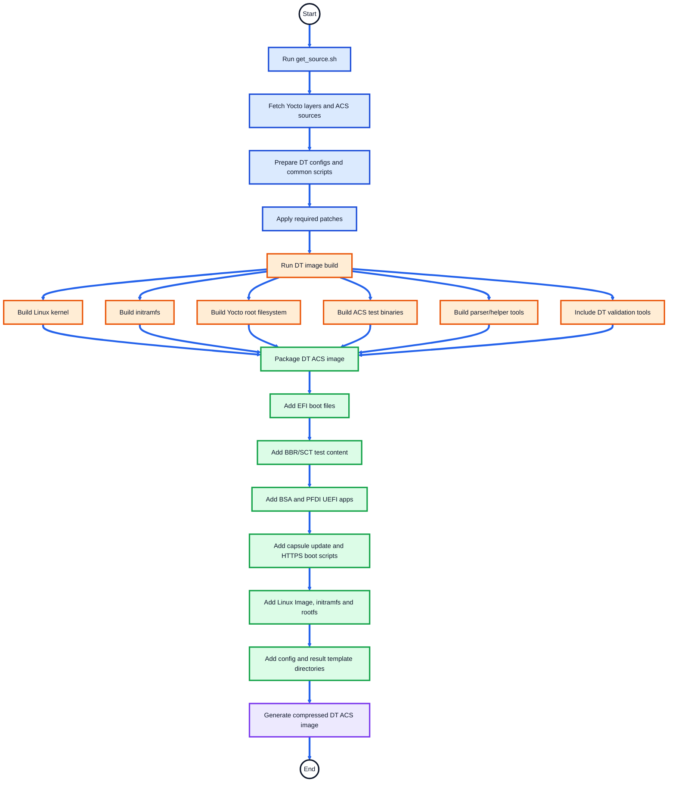
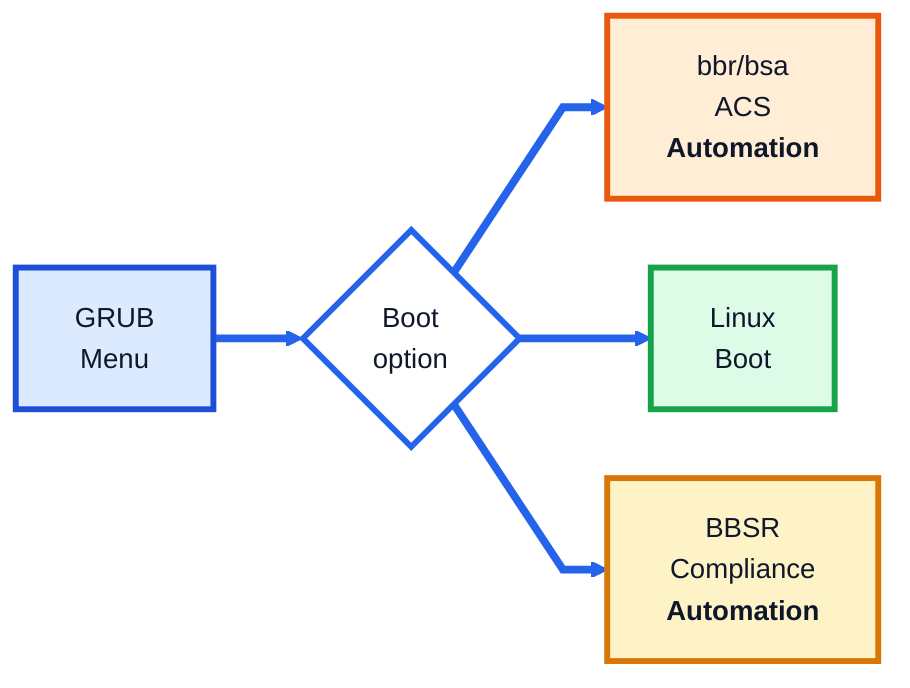
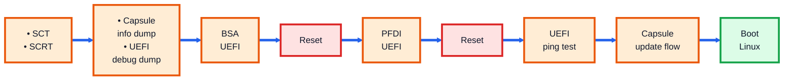

# SystemReady Devicetree Band ACS Automation Flow

## Overview

This document explains the automation flow of the **Arm SystemReady Devicetree Band ACS** image.

The SystemReady Devicetree Band ACS image is a bootable validation environment used to run firmware, UEFI, Linux, Devicetree, architecture, network, capsule update, and compliance test suites on Arm SystemReady Devicetree platforms.

The automation flow covers:

- Image validations
- SystemReady Devicetree Band ACS Automation Flow
- GRUB Boot Menu Options
- Configuration Files
- Result Collection

---

## What the DT Image Validates

| Validation Area | Tools / Test Suites |
|---|---|
| UEFI firmware compliance | SCT, SCRT, BBR |
| Base system architecture | BSA |
| Platform firmware/device interface | PFDI |
| Firmware behavior | FWTS |
| Secure Boot compliance | BBSR |
| Devicetree validation | DT validation tools, DT parser, DT kernel selftests |
| Linux device visibility | Device driver information script |
| Network validation | UEFI ping test, HTTPS/network boot, Ethernet checks |
| Block device validation | Block device read/write checks |
| Capsule update | Capsule update scripts and UEFI apps |
| Result reporting | EDK2 test parser, ACS log parser, waiver flow |

---

## SystemReady Devicetree Band ACS Automation Flow

This section explains the end-to-end automation flow for the SystemReady Devicetree Band ACS image.

The flow is divided into two parts:

1. **Build Automation Flow** — how the DT ACS image is prepared and generated.
2. **Run Automation Flow** — what happens when the DT ACS image boots on the platform.

---

### DT Build Automation Flow

Commands executed from **arm-systemready/SystemReady-devicetree-band/Yocto/**:

```text
./build-scripts/get_source.sh
./build-scripts/build-systemready-dt-band-live-image.sh
```



---
## DT Runtime Flowcharts

> These diagrams show the high-level runtime automation flow for the **SystemReady Devicetree Band ACS** image.  
> Some flows reset the platform after saving state or results. After reset, the platform returns to **GRUB** and resumes the next pending step using logs/state files.

---

### 1. Runtime Entry Flow

> By default, **bbr/bsa ACS (Automation)** is selected and the full DT automation flow is executed.



---

### 2. UEFI Automation Flow

> This flow is executed when **bbr/bsa ACS (Automation)** is selected from GRUB.



---

### 3. Linux Automation Flow

> This flow is executed either after **bbr/bsa ACS (Automation)** completes the UEFI phase, or directly when **Linux Boot** is selected from GRUB.

```mermaid
%%{init: {
  "theme": "base",
  "flowchart": {
    "curve": "linear",
    "nodeSpacing": 30,
    "rankSpacing": 40
  },
  "themeVariables": {
    "fontFamily": "Arial",
    "fontSize": "14px",
    "primaryBorderColor": "#0f172a",
    "lineColor": "#2563eb",
    "tertiaryColor": "#ffffff"
  }
}}%%

flowchart LR

    linkStyle default stroke:#2563eb,stroke-width:4px;

    A["• Linux<br/>  debug dump<br/>• Device driver<br/>  info"]
    A --> B["FWTS"]
    B --> C["BSA<br/>Linux"]

    C --> D["• Devicetree<br/>  validation<br/>• PSCI<br/>  collection"]
    D --> E["• DT kernel<br/>  selftest<br/>• Runtime<br/>  mapping check"]

    E --> F["• Ethernet /<br/>  network test<br/>• Block device<br/>  check"]

    F --> G["ACS log parser<br/><br/>(apply waivers<br/>if configured)"]
    G --> H["Print<br/>ACS summary"]

    classDef linux fill:#dcfce7,stroke:#16a34a,stroke-width:3px,color:#0f172a;
    classDef result fill:#ede9fe,stroke:#7c3aed,stroke-width:3px,color:#0f172a;

    class A,B,C,D,E,F linux;
    class G,H result;
```



---

### 4. Network Boot Flow

> This flow runs only when **HTTPS_BOOT_IMAGE_URL** is configured in `system_config.txt`.

```mermaid
%%{init: {
  "theme": "base",
  "flowchart": {
    "curve": "linear",
    "nodeSpacing": 25,
    "rankSpacing": 35
  },
  "themeVariables": {
    "fontFamily": "Arial",
    "fontSize": "14px",
    "primaryBorderColor": "#0f172a",
    "lineColor": "#2563eb",
    "tertiaryColor": "#ffffff"
  }
}}%%

flowchart LR

    linkStyle default stroke:#2563eb,stroke-width:4px;

    A["Linux<br/>pre-boot<br/>checks"]
    A --> B["Generate<br/>UEFI HTTPS<br/>boot config"]
    B --> R1["Reset"]

    R1 --> C["UEFI<br/>https_boot.nsh"]
    C --> D["Run<br/>ledge.efi"]
    D --> R2["Reset"]

    R2 --> E["U-Boot<br/>HTTP/HTTPS<br/>BootNext"]
    E --> F["Boot ACS<br/>minimal<br/>network image"]
    F --> G["Collect<br/>network boot<br/>logs"]
    G --> R3["Reset"]

    R3 --> H["Boot back<br/>to main<br/>ACS Linux"]
    H --> I["Network boot<br/>result parser"]

    classDef optional fill:#fef3c7,stroke:#d97706,stroke-width:3px,color:#0f172a;
    classDef uefi fill:#ffedd5,stroke:#ea580c,stroke-width:3px,color:#0f172a;
    classDef reboot fill:#fee2e2,stroke:#dc2626,stroke-width:3px,color:#0f172a;
    classDef linux fill:#dcfce7,stroke:#16a34a,stroke-width:3px,color:#0f172a;
    classDef result fill:#ede9fe,stroke:#7c3aed,stroke-width:3px,color:#0f172a;

    class A,B,E,F,G optional;
    class C,D uefi;
    class R1,R2,R3 reboot;
    class H linux;
    class I result;
```



---

### 5. Capsule Update Flow

> Linux prepares the capsule update check and reboots into UEFI. UEFI runs the capsule update flow, then Linux parses the result on the next boot.

```mermaid
%%{init: {
  "theme": "base",
  "flowchart": {
    "curve": "linear",
    "nodeSpacing": 25,
    "rankSpacing": 35
  },
  "themeVariables": {
    "fontFamily": "Arial",
    "fontSize": "14px",
    "primaryBorderColor": "#0f172a",
    "lineColor": "#2563eb",
    "tertiaryColor": "#ffffff"
  }
}}%%

flowchart LR

    linkStyle default stroke:#2563eb,stroke-width:4px;

    A["Linux<br/>capsule check"]
    A --> B["Prepare<br/>capsule update<br/>validation"]
    B --> R1["Reset"]

    R1 --> C["UEFI<br/>capsule<br/>update flow"]
    C --> D["Run<br/>CapsuleApp.efi"]
    D --> E["Store<br/>capsule result<br/>state"]
    E --> F["Continue<br/>boot flow"]

    F --> G["Boot back<br/>to Linux"]
    G --> H["Parse capsule<br/>update result"]

    classDef linux fill:#dcfce7,stroke:#16a34a,stroke-width:3px,color:#0f172a;
    classDef uefi fill:#ffedd5,stroke:#ea580c,stroke-width:3px,color:#0f172a;
    classDef reboot fill:#fee2e2,stroke:#dc2626,stroke-width:3px,color:#0f172a;
    classDef result fill:#ede9fe,stroke:#7c3aed,stroke-width:3px,color:#0f172a;

    class A,B,G linux;
    class C,D,E,F uefi;
    class R1 reboot;
    class H result;
```



---

### 6. BBSR Automation Flow

> DT BBSR includes Secure Boot key provisioning, secure Linux execution, and Secure Boot clearing before returning to Linux prompt.

```mermaid
%%{init: {
  "theme": "base",
  "flowchart": {
    "curve": "linear",
    "nodeSpacing": 25,
    "rankSpacing": 35
  },
  "themeVariables": {
    "fontFamily": "Arial",
    "fontSize": "14px",
    "primaryBorderColor": "#0f172a",
    "lineColor": "#2563eb",
    "tertiaryColor": "#ffffff"
  }
}}%%

flowchart LR

    linkStyle default stroke:#2563eb,stroke-width:4px;

    A["BBSR<br/>Compliance<br/><b>Automation</b>"]
    A --> B{"Secure Boot<br/>enabled?"}

    B -->|"yes"| D["BBSR<br/>UEFI / SCT<br/>flow"]
    B -->|"no"| C["Provision<br/>Secure Boot<br/>keys"]

    C --> D

    D --> E["Secure<br/>Linux boot"]
    E --> F["Collect<br/>BBSR logs<br/><br/>(FWTS / TPM)"]

    F --> G{"Secure Boot<br/>still enabled?"}
    G -->|"yes"| H["Request<br/>Secure Boot<br/>clearance"]
    G -->|"no"| M["ACS log parser<br/><br/>BBSR summary"]

    H --> R1["Reset"]
    R1 --> I["UEFI clears<br/>PK"]
    I --> R2["Reset"]
    R2 --> J["Boot Linux<br/>terminal / prompt"]

    J --> M

    classDef bbsr fill:#fef3c7,stroke:#d97706,stroke-width:3px,color:#0f172a;
    classDef decision fill:#ffffff,stroke:#2563eb,stroke-width:3px,color:#0f172a;
    classDef linux fill:#dcfce7,stroke:#16a34a,stroke-width:3px,color:#0f172a;
    classDef reboot fill:#fee2e2,stroke:#dc2626,stroke-width:3px,color:#0f172a;
    classDef uefi fill:#ffedd5,stroke:#ea580c,stroke-width:3px,color:#0f172a;
    classDef result fill:#ede9fe,stroke:#7c3aed,stroke-width:3px,color:#0f172a;

    class A,C,D bbsr;
    class B,G decision;
    class E,F,J linux;
    class H,M result;
    class R1,R2 reboot;
    class I uefi;
```


---

## GRUB Boot Menu Options

| Boot Option | Purpose |
|---|---|
| `Linux Boot` | Boots Yocto Linux environment |
| `bbr/bsa` | Runs the main automated DT compliance flow |
| `BBSR Compliance (Automation)` | Runs Secure Boot / BBSR compliance flow |

---

## Configuration Files

| File | Description |
|---|---|
| `acs_config.txt` | Contains ACS and specification version information |
| `system_config.txt` | Contains platform details used in the final ACS report |
| `acs_config_dt.txt` | DT-specific ACS configuration template |
| `system_config_dt.txt` | DT-specific system configuration template |

Important DT-related configuration fields:

| Field | Description |
|---|---|
| `Total_number_of_network_controllers` | Number of network controllers expected for validation |
| `HTTPS_BOOT_IMAGE_URL` | URL used for HTTPS/network boot validation |

---

## Result Collection

DT ACS logs and summaries are stored under:
```text
acs_results_template/acs_results/
```

Firmware and capsule-related logs are stored under:
```text
acs_results_template/fw/
```

Manual OS compliance logs are stored under:
```text
acs_results_template/os-logs/
```

Final parsed reports are generated under:
```text
acs_results_template/acs_results/acs_summary/
```
